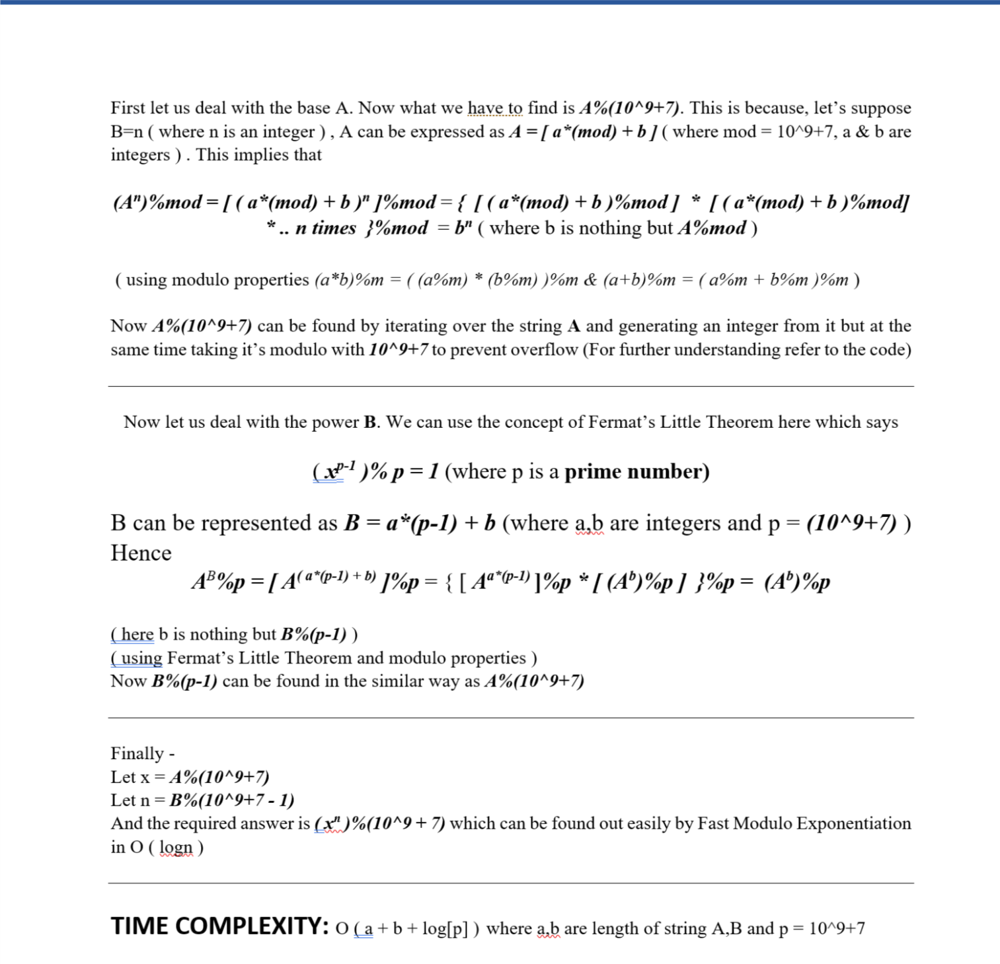

Lights New Car Hacker Blocks Problem based on Number Theory Concepts.


Read and Try **Light's New Car Problem** first yourself.
[Try now at **HackerBlocks**](https://hack.codingblocks.com/practice-section/p/66/92)


Video Solution by **Prateek Narang**
Editorial by **Suransh Chopra**

#### **Difficulty**: 
Medium

#### **Concepts Used**:
Fast Modulo Exponentiation, Modulo Properties, Fermat’s Little Theorem

#### **Statement**:
Given A and B, we have to find (A power B) % (10^9 + 7) where A, B<=10^100000

#### **Explanation**



#### Tester's Code **Prateek Narang**

**Solution**

```c
#include<bits/stdc++.h>
using namespace std;
typedef long long int ll;
ll mod = 1000000007;

ll stringToInt(string a,ll m){
    
    ll ans = 0;
    for(int i=0;i<a.size();i++){
        ans = (ans*10)%m + (a[i]-'0');
        ans %= m;
    }
    return ans;
}

ll Power(ll x,ll y,ll m){
    
    // Base Case
    if(y==0){
        return 1;
    }
    //Recursive x^(y/2)
    ll smallPower = Power(x,y/2,m);
    smallPower %= m;
    
    smallPower = (smallPower*smallPower)%m;
    
    if(y&1){
        return (x*smallPower)%m;
    }
    return smallPower;
    
    
}


int main(){
    
    
    ll t;
    cin>>t;
    
    string a,b;
    
    while(t--){
        cin>>a>>b;
        
        //String Into Integers
        ll x = stringToInt(a,mod);
        ll y = stringToInt(b,mod-1);
        
        //Power x^y
        ll ans = Power(x,y,mod);
        cout<<ans<<endl;
        
        
    }
    
    
    return 0;
}

```
